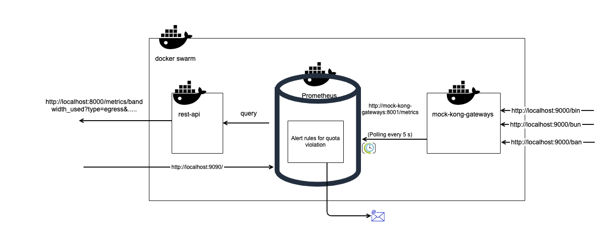
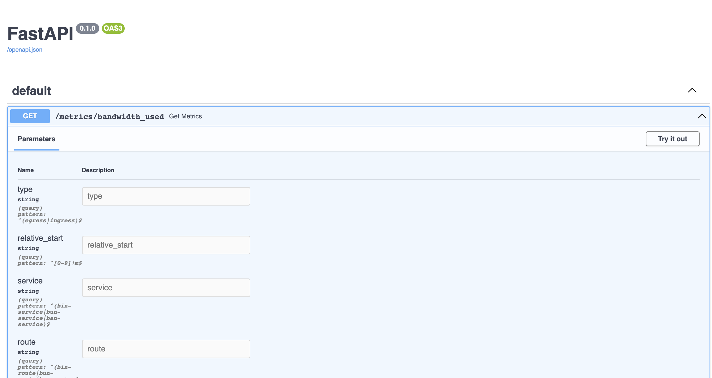

# A backend-for-frontend REST API serving telemetry data from other services.

## Problem Statement
Implement a Service that:
* collects the bandwidth (egress/ingress) metrics made available by gateway Prometheus plugin for each service. 
* provides a RESTful API that the frontend UI can use to display the used bandwidth via timeseries charts.
* triggers an email notification when the quota reaches 80%, 90% and 100% of a given bandwidth allocation quota.

Choose a persistence mechanism that is appropriate for this feature.

## Implementation
### Pre-requisites
* Install `docker` and make sure you have `docker compose`.
* `pipenv` for editing code.

### Architecture
Following are the components of the system:
* _REST API_: this the API that has been asked to be developed.
* _Mock Kong Gateway_: This is docker container running the kong gateway serving as mock backend gateways from which 
  prometheus metrics data is to be scraped periodically.  
* _Prometheus_: The datastore for storing and aggregating the timeseries data received for kong_bandwidth.
* Docker Swarm is used for networking all of these together.



### Running locally
1. `cd kong_take_home_hv/`
2. Build: `docker compose build`
3. Run: `docker compose --env-file ./local.env up`
   * To stop the application Ctrl + C
4. API:
   * Swagger can be accessed at http://localhost:8000/docs 
   * Sample request http://localhost:8000/metrics/bandwidth_used?lookback_duration=5m&type=egress&service=bun-service&route=bun-route
     * Sample output:
```
[
    {
        "time": "2022-02-17T18:35:00+00:00",
        "type": "egress",
        "service": "bun-service",
        "route": "bun-route",
        "bandwidth_used": null
    },
    {
        "time": "2022-02-17T18:36:00+00:00",
        "type": "egress",
        "service": "bun-service",
        "route": "bun-route",
        "bandwidth_used": null
    },
    {
        "time": "2022-02-17T18:37:00+00:00",
        "type": "egress",
        "service": "bun-service",
        "route": "bun-route",
        "bandwidth_used": null
    },
    {
        "time": "2022-02-17T18:38:00+00:00",
        "type": "egress",
        "service": "bun-service",
        "route": "bun-route",
        "bandwidth_used": null
    },
    {
        "time": "2022-02-17T18:39:00+00:00",
        "type": "egress",
        "service": "bun-service",
        "route": "bun-route",
        "bandwidth_used": 9133
    },
    {
        "time": "2022-02-17T18:39:41.043080+00:00",
        "type": "egress",
        "service": "bun-service",
        "route": "bun-route",
        "bandwidth_used": null
    }
]
```

   * Currently only the `kong_bandwidth` data is pulled from the mock kong gateways.
   * To check the metrics sent by mock kong gateway http://localhost:9001/metrics
   * To generate bandwidth metric send traffic to mock kong gateway. Eg. 
     * http://localhost:9000/bun
     * http://localhost:9000/bin
     * http://localhost:9000/ban   
   * Prometheus: http://localhost:9090/
5. Cleanup: `docker compose rm -f`

### TODOs and Enhancements
1. Add API tests.
